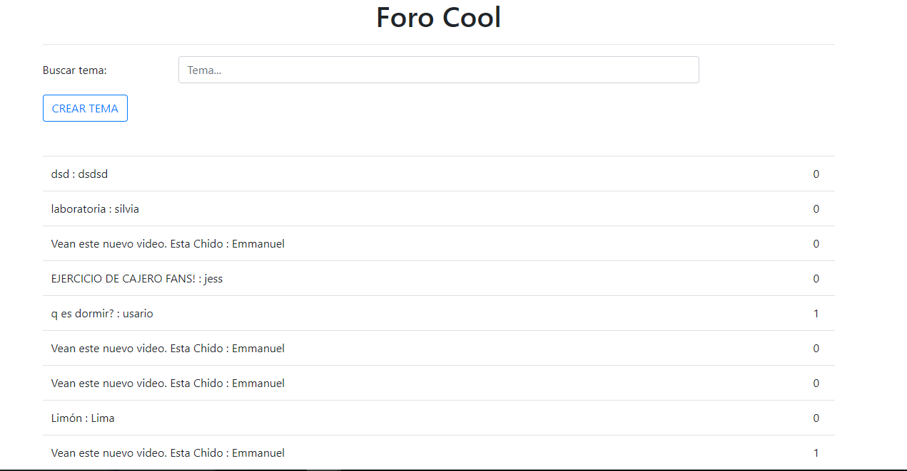
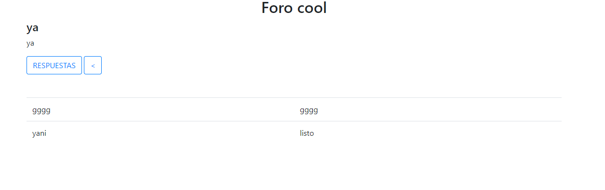

# sprint-5-boilerplate

* **Track:** _Common Core_
* **Curso:** _Connstruye una single page (SPA) multi-uusuario consumiendo data remota_
* **Unidad:** _Ejercicio con sprint-5-boilerplate_

*** 
[PRUEBA boilerplate](https://github.com/MelynaPernia/sprint-5-boilerplate).

***
## OBJETIVO

* Realizar un foro donde podamos crear temas y responder a esos temas. 

## PROCESO

* Investigar sobre el API, llamado Foro API.

* Luego identificar los requerimientos.

    **Un tema tiene:**

        Un título
        Un contador de número de respuestas
        Un autor

    **Una respuesta tiene:**

        Un topic_id (para saber de que tema es la respuesta)
        El contenido de la respuesta
        El autor

## Ejemplo

* Vista principal de la página, donde se muestra todos los temas ya creados en el API y también se puede crear una nueva tarea.

* Vista de las respuestas de un tema previamente seleccionado.

## Recursos

- Html,css,javascript.
- Jquery.
- API: foro API.

## Integrantes(GitHub)

* [LAURA JIMENEZ](https://github.com/LauraJH16)
* [MARINA RODRIGUEZ](https://github.com/MarinaRH)
* [MELINA PERNIA ](https://github.com/MelinaPernia)